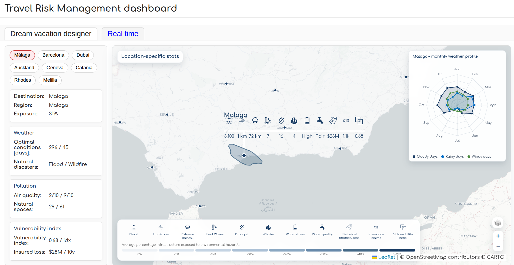
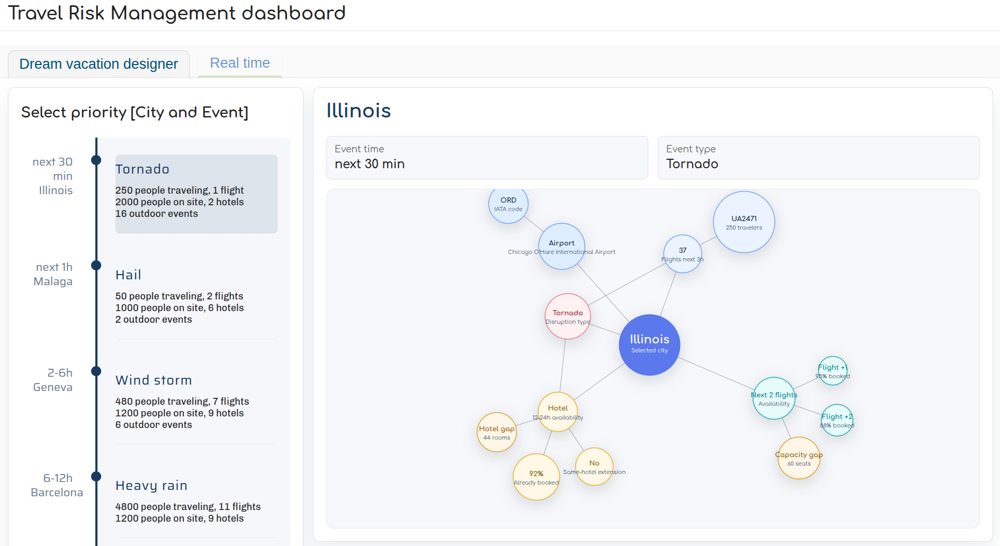

# Travel Risk Dashboard

To run this project:

python -m http.server 8000

Then open in your browser:
http://localhost:8000/ 

To create a self-running HTML webapp :
python make_single_file.py

## Dream vacation designer tool 

## Short term critical event management tool

Keep your travellers safe and satisfied, no matter last minute weather

Save your clients from getting stuck at the airport after a cancelled flight

